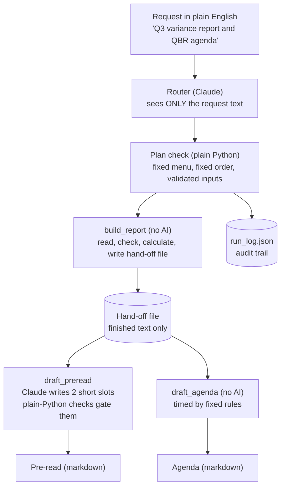

# Agentic Rhythm of Business (RoB) & OPEX Controller

A small system of AI agents and deterministic code for preparing a quarterly operating-expense (OPEX) review, built with the
[Claude Agent SDK](https://docs.claude.com). It reads budget and spend data, flags variances, drafts a
pre-read for senior leaders and builds a timed meeting agenda.

**The design rule: AI writes, code calculates.** No AI model is ever asked to do arithmetic, and none is
given a raw spreadsheet. Every figure is calculated and formatted by ordinary, tested Python, and any number
an AI model writes is checked against that source. Where a document must contain something (a caveat, a
flagged line), code writes it instead of trusting a model to remember it.

*Terms: RoB = "Rhythm of Business", the recurring cadence of budget reviews and leadership meetings;
QBR = quarterly business review; SLT = senior leadership team; OPEX = operating expense.*

**At a glance**

- Three AI-driven components (a request router, a Variance Q&A agent and a Comms drafter) wrapped around a
  deterministic calculator
- 267 tests that run offline with no API key, and the whole thing was checked from a clean clone
- Cost with the low-cost Haiku model: about 0.3 cents for an agenda-only request, about 6 cents for a full run
  with an AI-drafted pre-read

> **About this project.** A personal learning and portfolio project by Rohan Kalsotra, a business operations
> consultant with no prior professional coding background. I supplied the business rules (how duplicates and
> PO extensions work, the flag thresholds, the K/M/B display, the reviewer-decision workflow) and reviewed
> and ran every piece; the code was written with Claude acting as a pair-programming tutor, one small piece at
> a time, with tests for each. It is a generalized rebuild of the kind of budget-review work done in large
> organizations. **All data in this repository is synthetic** (invented names, vendors, POs and numbers).
> It is not production software.

---

## The problem

Before every quarterly business review, someone reconciles budgets against actual spend, flags variances,
chases down data problems, writes a briefing and builds an agenda. It can take days, it is repetitive, and the
risky part is not the writing. It is a wrong number reaching a senior leader. So the question this project
asks is: **how do you use AI for the writing without letting it calculate or alter the numbers?**

## How it works



The Variance Agent (a question-and-answer assistant over the same calculator) is a separate entry point, not a
step in this pipeline. The pipeline's `build_report` step calls the same deterministic code directly.

**Design choice: a workflow with AI steps, not a free-roaming agent.** The router can only choose from three
approved steps, the Comms Agent has no tools at all, and the one component that picks its own tool calls (the
Variance Agent) has two read-only tools. For finance work, a predictable path was worth more to me than
flexibility.

| Part | What it does | AI involved? |
|---|---|---|
| **Data engine** (`variance_engine.py`) | Reads a Budget sheet and a Transactions sheet, checks the data (duplicates, missing amounts, missing IDs), applies a separate file of reviewer decisions with an audit trail | No |
| **Variance math** (`variance_math.py`) | Calculates budget vs actual for the quarter and year to date at three levels (total, cost center, cost center + category) and flags OVER / UNDER lines | No |
| **Text cards** (`variance_tools.py`) | Turns every number into finished text ("+$61.7K", "+45.7%") before any model sees it | No |
| **Variance Agent** (`variance_agent.py`) | Claude answers questions about the results by calling two tools that return the text cards | Yes; `verifier.py` checks every answer and shows the verdict, but does not block it |
| **Hand-off file** (`handoff.py`) | One JSON file of finished text. It is the only thing the Comms side may read | No |
| **Pre-read** (`preread.py`) | Builds the leadership pre-read: numbers, flagged lines, data caveats, follow-ups | No, except two labelled slots |
| **Comms Agent** (`comms_agent.py`, `comms_checks.py`) | Claude drafts only a headline and discussion points; plain-Python checks accept or discard the draft | Yes, gated |
| **Agenda** (`agenda.py`) | Timed QBR agenda from fixed rules, biggest variance first | No |
| **Orchestrator** (`orchestrator.py`) | Claude suggests steps from a fixed menu; plain code validates, orders and runs them and writes an audit log | Yes, only to suggest steps |

## The trust boundary

1. **Code calculates, models narrate.** Every figure comes from pandas code. Even the "$1.2K / $4.5M"
   formatting is done in code, so a model can only copy text, never convert or round. Models are instructed
   never to calculate, and a plain-Python check flags any number that is not in the source.
2. **Models see only what they need.** The router sees the request and nothing else. The Comms Agent sees only
   the hand-off file, never the workbook, and its source files are forbidden (by a test) from importing the
   calculator or pandas.
3. **Everything that must always appear is written by code.** In the pre-read and the agenda, the numbers,
   flagged lines, data-quality notes, caveats and follow-ups are generated by plain Python, so a model cannot
   forget or reword them. (The Variance Agent's free-form answers are the exception; see the limitations.)
4. **AI drafts for the pre-read are checked before use.** A draft that fails is shown its problems once. If it
   fails again it is thrown away and the document keeps a clearly marked placeholder. The Variance Agent's
   answers are checked after the fact and the verdict is shown, but they are not blocked.
5. **Claude suggests, code decides.** The router can only pick from three approved steps. Anything else is
   dropped, and the order is fixed, so a cleverly worded request cannot add an action.
6. **A human reviews.** Every generated document ends with a "human has reviewed this" checkbox, and every
   run writes an audit log.
7. **Least privilege.** Every model call runs with no built-in tools (no file, web or shell access), a turn
   limit and a dollar cap. The router and the Comms Agent get no tools at all; the Variance Agent gets two
   read-only ones.

The boundary is enforced by code structure and tests inside one program (what each function is handed, and
which modules it may import), not by an operating-system sandbox.

### What the checks catch

| Check | Catches | Cannot catch |
|---|---|---|
| **Number verifier** (`verifier.py`) | Any number or ID in an AI answer that is not in the source text; flipped +/- signs; numbers a model calculated itself | Wrong *meaning* (right numbers, wrong team), numbers written as words, a wrong number that happens to equal another number already in the source |
| **Banned wording** (`comms_checks.py`) | Judgment words ("significantly") and invented causes ("because", "postponed") | Subtle wording problems |
| **Completeness check** | A flagged line or a known data caveat left out of the discussion points | Whether the point is well written |
| **Control total** | Any transaction lost between the raw data and the report | Errors in the source data itself |
| **Plan check** | A step that is not on the menu, wrong order, a bad meeting length | Whether the request was sensible |
| **Human review** | Everything above, plus tone and judgment | Nothing is perfect |

## Data rules the engine follows

- **Transaction ID decides duplicates.** The same ID twice with identical details is an automatic duplicate.
  A PO with two lines and different Transaction IDs is a legitimate extension, not a duplicate.
- **A row with no Transaction ID is never removed automatically.** If it looks identical to another row it is
  flagged for a human. The human's decision goes in a separate review file, and the original data is untouched.
- **A blank amount is never guessed.** It is left blank and flagged until a reviewer supplies a value.
- **Flag rule:** a line or team is OVER / UNDER only when it is off by at least 10% **and** at least $10,000.
- **Variance = Actual minus Budget.** A plus sign means more was spent than budgeted.
- **Missing months are shown, not assumed.** A budgeted month with no transactions is called out as
  "could be true, or a posting could be missing".

## Try it

You need Python 3.11 or newer (developed on 3.13). Steps 1 to 4 need no API key and cost nothing.

```bash
# 1. get the code and set up a private Python environment
git clone <your-repo-url>
cd <repo-folder>
python3 -m venv venv
source venv/bin/activate
pip install -r requirements.txt

# 2. (optional) regenerate the synthetic sample workbook; a copy is already in data/
python scripts/make_sample_data.py

# 3. run the tests (more than 260, all offline)
python -m pytest -q

# 4. run the parts that use no AI
python agents/variance_math.py      # the variance report, printed
python agents/handoff.py            # writes outputs/variance_handoff.json
python agents/preread.py            # writes outputs/preread_draft.md (AI slots left as placeholders)
python agents/agenda.py             # writes outputs/qbr_agenda.md
```

To run the AI parts you need an Anthropic API key. Create a file named `.env` in the project folder
(it is git-ignored) containing one line, `ANTHROPIC_API_KEY=your-key-here`, and never share or commit it.

```bash
python agents/variance_agent.py "Give me the Q3 variance report"     # about 1 to 2 cents
python agents/comms_agent.py                                          # drafts the two AI slots
python agents/orchestrator.py "Give me the Q3 variance report and prep the QBR agenda"   # about 6 cents, about a minute
python agents/orchestrator.py "Just the agenda for a 90 minute QBR"  # a fraction of a cent
```

The AI steps use the low-cost Haiku model by default. Change `MODEL` at the top of a file to use another one.
Generated files land in `outputs/`, which is git-ignored because real data could end up there.

## Sample output

From the synthetic data, Q3 2026 (budget $1.35M, actual $1.39M, variance +$43.6K / +3.2%, on track), the
flagged lines, largest dollar swing first:

| Line | Status | Variance |
|---|---|---|
| Field Sales / Contractors | OVER | +$61.7K (+45.7%) |
| Engineering Ops / Software & Subscriptions | UNDER | -$32.3K (-59.8%) |
| Marketing / Travel | OVER | +$20.3K (+33.8%) |
| Marketing / Events & Marketing | UNDER | -$11.5K (-31.9%) |

The pre-read also carries the data notes, for example: *"Marketing / Events & Marketing, Sep 2026 (budget
$12.0K). No transactions were recorded. This could be true, or a posting could be missing. Someone should
confirm before reading this line as real underspend."* That sentence is written by code, not by a model.

The generated agenda for a 60-minute meeting gives each flagged line 10 minutes and each fixed item 5.
Times are shared out by simple whole-number rules, and a test checks that they always add up to the meeting length.

## What went wrong along the way (and what changed)

The most useful part of this project was watching the AI make mistakes. Each fix below is now covered by an
automated test, so a regression is caught without spending any API money. (The judgment-word and omission
checks are enforced on the Comms Agent; the Variance Agent only has prompt rules for them.)

| What the model did | The fix | Lesson |
|---|---|---|
| Said a transaction was removed when it was kept | The data engine's own message now says which row was kept | Put the exact wording in the data |
| Skipped a tool the prompt told it to call | The information now travels inside the report itself | A prompt is a request, not a guarantee |
| Guessed a team name from a bare ID | Reports never contain bare IDs, only names (a test enforces it) | Do not hand a model a puzzle |
| Invented a cause ("postponed") and used judgment words | Banned-wording check, and questions instead of explanations | The data shows what changed, never why |
| Left out a required caveat when answering a year-to-date question | Completeness check, added for the Comms Agent's drafts | A number checker cannot see what is missing |
| A safety check misread `3,` in a list as one number | Fixed and tested | Test your safety net too |
| A full run sat silent for a minute | Progress messages | Silence looks like failure |

## Known limitations

- **Synthetic data only.** It has planted problems (a duplicate, a legitimate PO extension, a blank amount and
  so on) so the code can be checked against a known answer key. Real data would be messier.
- **Free-form Variance Agent answers are only checked for numbers**, not for omissions or wording. The Comms
  Agent's drafts get the fuller set of checks.
- **Wording quality is not checked.** Drafts can be clumsy, which is one reason a human reviews them.
- **Numbers written as words** ("three duplicates") are not verified.
- **Small sample of live runs.** Roughly seven Variance Agent runs and a handful of Comms Agent and
  Orchestrator runs: enough to find failure modes, not to measure a failure rate. Models can also change
  over time.
- **The Variance Agent is not wired into the Orchestrator.** It is a standalone question-and-answer tool.
- **The trust boundary is structural, not a sandbox.** Everything runs in one Python program on one machine.
- **The agenda ranks by dollar swing only.** It does not weigh importance or who is available.
- **Owners and due dates are never invented.** Follow-ups say "to be assigned" on purpose.

## Project layout

```
agents/
  variance_engine.py   read + check data, apply reviewer decisions        (no AI)
  variance_math.py     quarter / year-to-date variance and flags          (no AI)
  variance_tools.py    numbers become finished text cards                 (no AI)
  variance_state.py    load, decide, calculate in one call                (no AI)
  formatting.py        $K / $M / $B display                               (no AI)
  variance_agent.py    Variance Agent (Claude + two tools)
  verifier.py          checks every number in a model's text              (no AI)
  handoff.py           the one file passed to the Comms side              (no AI)
  preread.py           builds the leadership pre-read                     (no AI)
  comms_checks.py      gates the AI-written headline and points           (no AI)
  comms_agent.py       Comms Agent (Claude writes two slots)
  agenda.py            timed QBR agenda                                    (no AI)
  orchestrator.py      fixed-menu router, step runner, audit log
hello_claude.py              a tiny test that the API key and connection work
scripts/make_sample_data.py   builds the synthetic workbook
data/                         sample workbook + sample reviewer decisions
tests/                        more than 260 tests, including the trust-boundary tests
outputs/                      generated files (git-ignored)
```

## Tests

More than 260 tests, all of which run offline. The AI-facing loops (the Comms Agent's draft-check-retry cycle
and the Orchestrator) are tested with a fake model, so they cost nothing to run. Some tests read the source
files and fail if the Comms side ever imports the calculator or pandas; others check behavior, for example
that the router is handed only the request text. Several checks were also verified by breaking the code on
purpose and confirming the tests failed.

## Roadmap

- Route free-form questions from the Orchestrator to the Variance Agent
- Trim the prompt sent to the Comms Agent to lower its cost
- Extend the completeness and wording checks to the Variance Agent's free-form answers
- Try a larger model for the polished drafts and compare
- Write up the design in three short posts: architecture and governance, the return on executive time, and
  building trust in AI-generated financial reports
